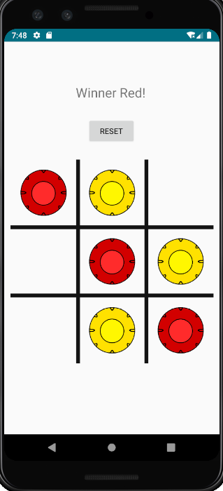

# Connect3

Android game created in Android Studio.   
Created a Tic Tac Toe game with Grid Layout and image buttons to be able to click on the screen and drop a yellow or red
token. 
Used array to keep track of players current positions. Constantly checks if ther is a winner
and displays winner when 3 in row is achieved. 

# What I Learned

* Used image Views to create better UI (previous vesion used text 'x' and 'o')
* Animated images to appear to drop in screen
* Published to Google app store: [Connect3](https://play.google.com/store/apps/details?id=ceslopez.com.connect3game)

 

